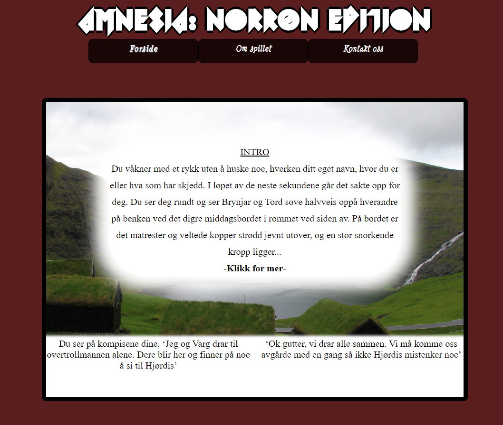
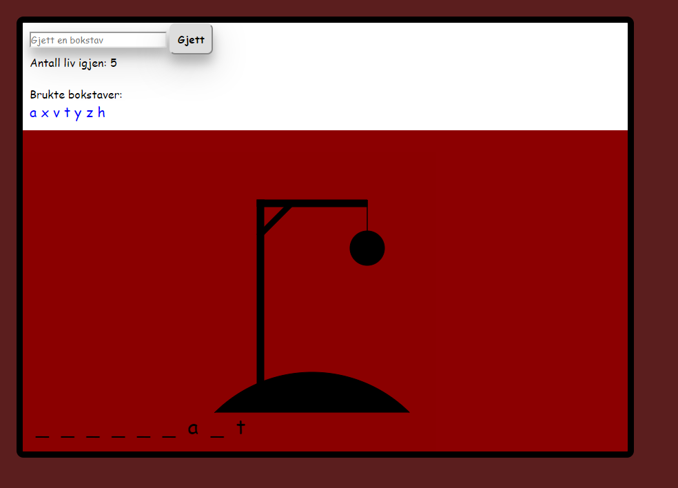
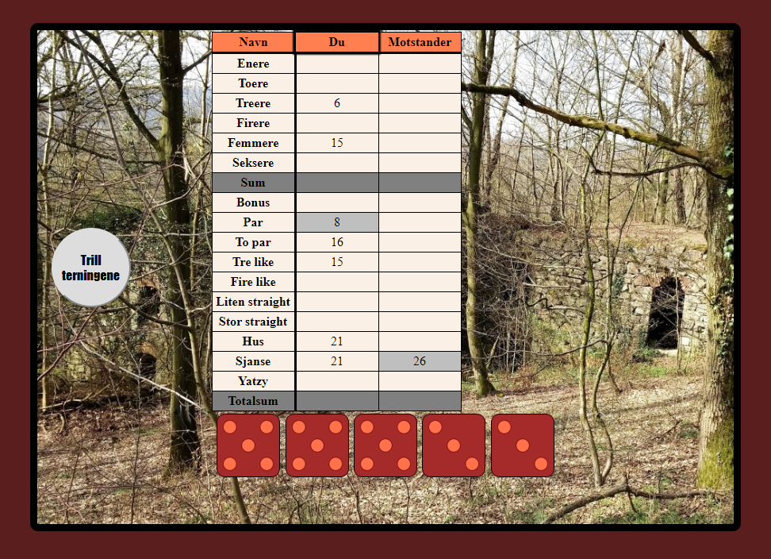
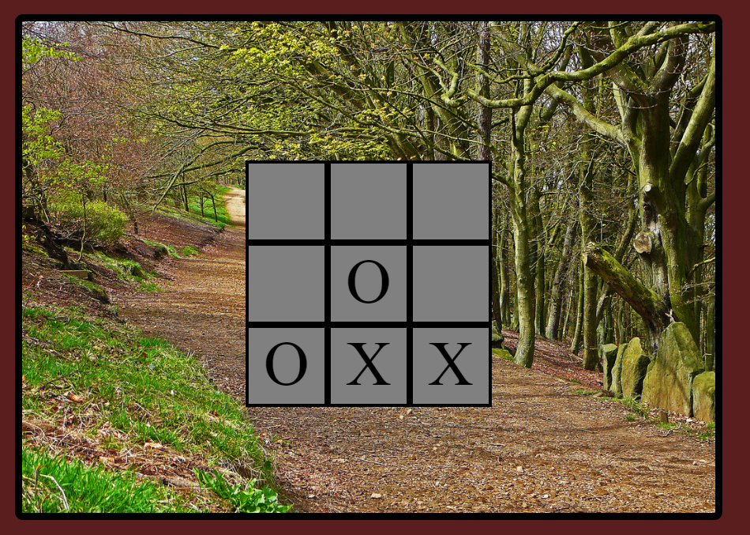

# NTNU-game-project

Dette prosjektet var en delvurdering(25%) i 25-poengsemnet IDRI1002 https://www.ntnu.no/studier/emner/IDRI1002
Prosjektet ble gjennomført av en gruppe med 5 medlemmer

Spillet er tekstbasert og valgene du tar underveis fører til ulike deler av spillet. Småspill som er integrert, er yatzy, bondesjakk og hangman. 

Link til spillet: http://folk.ntnu.no/rikardeg/spillprosjekt_team26/

Teknologier i bruk:
JavaScript, HTML, CSS og JSON

## Bilder fra spillet:

